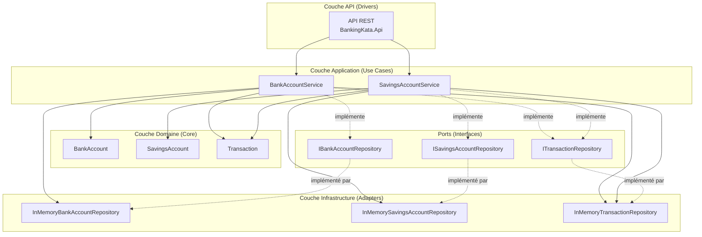
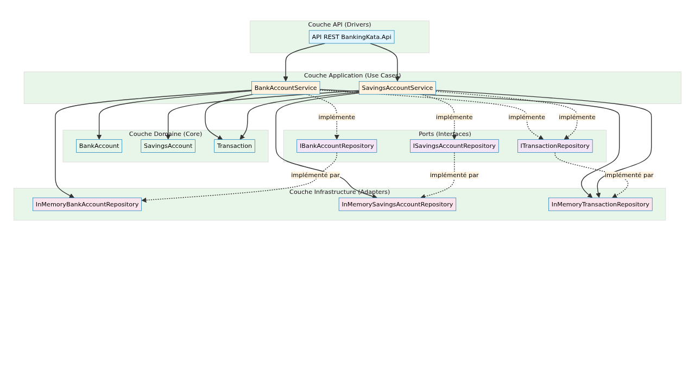

# BankingKata - Architecture Hexagonale

Application bancaire en **architecture hexagonale** (ports & adapters) avec .NET 8 et tests complets.

## Architecture

### Schéma de l'Architecture Hexagonale





### Structure du Projet

```
BankingKata/
├── BankingKata.sln
│
├── BankingKata.Domain/              # 🟢 Core - Règles métier pures
│   └── Entities/
│       ├── BankAccount.cs           # Compte courant
│       ├── SavingsAccount.cs        # Livret d'épargne
│       └── Transaction.cs           # Opération
│
├── BankingKata.Application/         # 🟡 Use Cases
│   ├── DTOs/                       # Data Transfer Objects
│   │   ├── BankAccountDto.cs
│   │   ├── SavingsAccountDto.cs
│   │   └── StatementDto.cs
│   ├── Ports/                      # Interfaces (contrats)
│   │   ├── IBankAccountRepository.cs
│   │   ├── ISavingsAccountRepository.cs
│   │   └── ITransactionRepository.cs
│   └── UseCases/                    # Logique applicative
│       ├── BankAccountService.cs
│       └── SavingsAccountService.cs
│
├── BankingKata.Infrastructure/      # 🔵 Adapters - Implémentations
│   └── Persistence/
│       ├── InMemoryBankAccountRepository.cs
│       ├── InMemorySavingsAccountRepository.cs
│       └── InMemoryTransactionRepository.cs
│
├── BankingKata.Api/                 # 🚀 API REST
│   ├── Controllers/
│   │   ├── AccountsController.cs
│   │   └── SavingsController.cs
│   ├── Program.cs
│   └── Properties/
│
├── BankingKata.Tests/               # 🧪 Tests Unitaires
│   ├── BankAccountTests.cs
│   ├── BankAccountServiceTests.cs
│   ├── SavingsAccountTests.cs
│   └── SavingsAccountServiceTests.cs
│
├── BankingKata.Api.Tests/           # 🧪 Tests d'Intégration
│   ├── AccountsControllerTests.cs
│   └── SavingsControllerTests.cs
│
├── .github/
│   ├── workflows/
│   │   ├── ci.yml                  # Pipeline CI
│   │   └── cd.yml                  # Pipeline CD
│   └── environments/
│       ├── staging.json
│       └── production.json
│
├── k8s/                            # ☸️ Kubernetes
│   ├── charts/bankingkata-api/     # Helm chart
│   └── environments/               # Overlays
│       ├── staging/
│       └── production/
│
├── Dockerfile                       # 🐳 Multi-stage build
├── docker-compose.yml               # Dev environment
├── docker-compose.prod.yml          # Prod with Traefik
├── GitVersion.yml                  # 📋 Versioning strategy
└── .dockerignore
```

### Principes de l'Architecture Hexagonale

| Principe | Implémentation |
|----------|----------------|
| **Indépendance du domaine** | `BankingKata.Domain` n'a aucune dépendance externe |
| **Ports (interfaces)** | `IBankAccountRepository`, `ITransactionRepository` |
| **Adapters** | Implémentations concrètes (`InMemoryBankAccountRepository`) |
| **Use Cases** | `BankAccountService`, `SavingsAccountService` |
| **Injection de dépendances** | .NET DI container dans `Program.cs` |

## Fonctionnalités

### Feature 1 : Compte Bancaire

Compte courant avec dépôt et retrait.

| Fonctionnalité | Description |
|----------------|-------------|
| Numéro de compte | Identifiant unique |
| Solde | Montant actuel |
| Dépôt | Ajout d'argent |
| Retrait | Retrait avec vérification du solde |

**Règle métier :** Un retrait ne peut pas dépasser le solde disponible.

### Feature 2 : Découvert Autorisé

Extension du compte courant avec une autorisation de découvert.

| Fonctionnalité | Description |
|----------------|-------------|
| OverdraftLimit | Montant maximum du découvert |
| Retrait étendu | Autorisé jusqu'à `solde + découvert` |

**Règle métier :** Un retrait est autorisé si `montant ≤ solde + autorisation_decouvert`.

### Feature 3 : Livret d'Épargne

Compte avec plafond de dépôt, sans découvert possible.

| Fonctionnalité | Description |
|----------------|-------------|
| DepositCeiling | Plafond maximum de dépôt |
| Dépôt limité | Vérification du plafond |
| Pas de découvert | Retrait limité au solde |

**Règle métier :** Un dépôt ne peut pas dépasser le plafond du livret.

### Feature 4 : Relevé de Compte

Historique des opérations sur un mois glissant.

| Fonctionnalité | Description |
|----------------|-------------|
| Type de compte | "Compte Courant" ou "Livret" |
| Solde actuel | Balance à la date d'émission |
| Opérations | Liste triée antéchronologique |

## API Endpoints

### Comptes Courants

| Méthode | Endpoint | Description | Corps |
|---------|----------|-------------|-------|
| `GET` | `/api/accounts` | Liste tous les comptes | - |
| `GET` | `/api/accounts/{accountNumber}` | Récupère un compte | - |
| `POST` | `/api/accounts` | Crée un compte | `CreateAccountDto` |
| `POST` | `/api/accounts/{accountNumber}/deposit` | Dépôt | `TransactionDto` |
| `POST` | `/api/accounts/{accountNumber}/withdraw` | Retrait | `TransactionDto` |
| `POST` | `/api/accounts/{accountNumber}/overdraft` | Modifie le découvert | `SetOverdraftDto` |
| `GET` | `/api/accounts/{accountNumber}/statement` | Relevé de compte | Query params: `fromDate`, `toDate` |

### Livrets d'Épargne

| Méthode | Endpoint | Description | Corps |
|---------|----------|-------------|-------|
| `GET` | `/api/savings` | Liste tous les livrets | - |
| `GET` | `/api/savings/{accountNumber}` | Récupère un livret | - |
| `POST` | `/api/savings` | Crée un livret | `CreateSavingsAccountDto` |
| `POST` | `/api/savings/{accountNumber}/deposit` | Dépôt | `SavingsTransactionDto` |
| `POST` | `/api/savings/{accountNumber}/withdraw` | Retrait | `SavingsTransactionDto` |
| `GET` | `/api/savings/{accountNumber}/statement` | Relevé de livret | Query params: `fromDate`, `toDate` |

## DTOs (Data Transfer Objects)

### BankAccountDto
```json
{
  "accountNumber": "ACC001",
  "balance": 1000.00,
  "overdraftLimit": 500.00
}
```

### CreateAccountDto
```json
{
  "accountNumber": "ACC001",
  "initialBalance": 1000.00,
  "overdraftLimit": 500.00
}
```

### SavingsAccountDto
```json
{
  "accountNumber": "SAV001",
  "balance": 5000.00,
  "depositCeiling": 22950.00
}
```

### CreateSavingsAccountDto
```json
{
  "accountNumber": "SAV001",
  "depositCeiling": 22950.00,
  "initialBalance": 1000.00
}
```

### StatementDto (Relevé)
```json
{
  "accountNumber": "ACC001",
  "accountType": "Compte Courant",
  "currentBalance": 1200.00,
  "statementDate": "2026-04-12T12:00:00Z",
  "operations": [
    {
      "id": "3fa85f64-5717-4562-b3fc-2c963f66afa6",
      "accountNumber": "ACC001",
      "amount": 500.00,
      "type": "Deposit",
      "date": "2026-04-12T11:30:00Z",
      "balanceAfterTransaction": 1500.00
    }
  ]
}
```

## Installation et Lancement

### Prérequis
- .NET 8.0 SDK
- (Optionnel) Node.js pour le frontend React

### Lancer l'API

```bash
cd BankingKata/BankingKata.Api
dotnet run
```

L'API sera disponible sur `http://0.0.0.0:5000`

Swagger UI accessible sur `http://0.0.0.0:5000/swagger`

### Lancer les Tests

```bash
dotnet test
```

### Structure des Tests

| Projet | Type | Couverture |
|--------|------|------------|
| `BankingKata.Tests` | Unitaires | Domain + Application |
| `BankingKata.Api.Tests` | Intégration | API REST |

## Exemples d'Utilisation

### Créer un compte courant avec découvert

```bash
curl -X POST http://localhost:5000/api/accounts \
  -H "Content-Type: application/json" \
  -d '{"accountNumber": "ACC001", "initialBalance": 1000, "overdraftLimit": 500}'
```

### Effectuer un dépôt

```bash
curl -X POST http://localhost:5000/api/accounts/ACC001/deposit \
  -H "Content-Type: application/json" \
  -d '{"amount": 250}'
```

### Effectuer un retrait (avec découvert)

```bash
curl -X POST http://localhost:5000/api/accounts/ACC001/withdraw \
  -H "Content-Type: application/json" \
  -d '{"amount": 1200}'
```

### Créer un livret d'épargne

```bash
curl -X POST http://localhost:5000/api/savings \
  -H "Content-Type: application/json" \
  -d '{"accountNumber": "SAV001", "depositCeiling": 22950, "initialBalance": 5000}'
```

### Obtenir un relevé

```bash
curl "http://localhost:5000/api/accounts/ACC001/statement"
```

### Obtenir un relevé sur une période

```bash
curl "http://localhost:5000/api/accounts/ACC001/statement?fromDate=2026-03-01&toDate=2026-04-12"
```

## Décision de Design : TransactionRepository Shared

Une décision de design importante : les deux types de comptes (`BankAccount` et `SavingsAccount`) partagent le même `ITransactionRepository`. 

**Rationalité :**
- Un client peut avoir plusieurs comptes (courant + livret)
- Un relevé consolidé pourrait être nécessaire
- Simplifie la persistence (une seule table/collection)

**Alternative possible :** Un `TransactionRepository` par type de compte si isolation stricte requise.

## Statuts HTTP

| Code | Signification |
|------|---------------|
| `200 OK` | Succès |
| `201 Created` | Ressource créée |
| `400 Bad Request` | Erreur de validation |
| `404 Not Found` | Ressource non trouvée |
| `409 Conflict` | Ressource déjà existante |

---

## CI/CD Pipeline

### GitHub Actions Workflows

#### CI Pipeline (`.github/workflows/ci.yml`)

| Étape | Description |
|-------|-------------|
| Checkout | Récupération du code |
| Setup .NET | Installation .NET 8 |
| Restore | Restauration des dépendances |
| Build | Compilation en Release |
| Tests | Tests unitaires |
| Integration Tests | Tests d'intégration API |

#### CD Pipeline (`.github/workflows/cd.yml`)

| Étape | Description |
|-------|-------------|
| Checkout | Récupération du code |
| Docker Buildx | Configuration multi-platform |
| Login | Connexion à GHCR |
| Build & Push | Construction et push de l'image Docker |

### Docker

#### Dockerfile

```dockerfile
FROM mcr.microsoft.com/dotnet/sdk:8.0 AS build
WORKDIR /src
# ... build steps ...

FROM mcr.microsoft.com/dotnet/aspnet:8.0 AS runtime
WORKDIR /app
EXPOSE 5000
ENTRYPOINT ["dotnet", "BankingKata.Api.dll"]
```

#### Docker Compose

```bash
# Développement
docker-compose up -d

# Production avec Traefik
docker-compose -f docker-compose.prod.yml up -d
```

### Kubernetes

#### Helm Chart

```bash
# Staging
helm upgrade --install bankingkata ./k8s/charts/bankingkata-api \
  -f ./k8s/environments/staging/values.yaml \
  -n bankingkata --create-namespace

# Production
helm upgrade --install bankingkata ./k8s/charts/bankingkata-api \
  -f ./k8s/environments/production/values.yaml \
  -n bankingkata --create-namespace
```

### Commandes Utiles

```bash
# Build local Docker
docker build -t bankingkata-api:latest .

# Run avec docker-compose
docker-compose up -d

# Run avec monitoring
docker-compose -f docker-compose.prod.yml up -d
```
